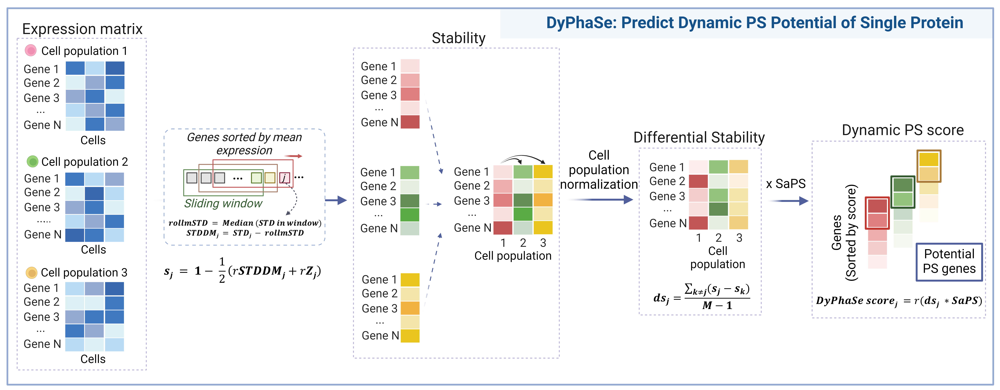

# Introduction to DyPhaSe
DyPhaSe (Dynamic Phase Separation Predictor) is a computational framework designed to predict context-specific phase separation (PS) dynamics using single-cell RNA sequencing data. By integrating gene expression variability with intrinsic PS potential, DyPhaSe provides a robust and systematic approach for identifying dynamic PS events in various biological contexts.

This repository contains the source code for DyPhaSe, enabling researchers to predict dynamic PS events in biological contexts of interest.

---
# Install
```bash
# Step 1: Create a new conda virtual environment with Python 3.9
conda create --name DyPhaSe python=3.9

# Step 2: Activate the new environment
conda activate DyPhaSe

# Step 3: Install the required libraries
pip install pandas==2.1.1 numpy==1.26.1 seaborn==0.11.0 matplotlib==3.8.1 scipy==1.11.3 

# Step 4: Clone the DyPhaSe repository from GitHub
git clone https://github.com/TingtingLiGroup/DyPhaSe.git

# Step 5: Navigate into the cloned repository directory
cd DyPhaSe

# Step 6: Install the package using setup.py
pip install .
```

---
# Function Documentation
## Predict Dynamic PS Potential of Single Protein

Here, we provide the calculation function `calculate_dyphase_score` and the plotting function `plot_dyphase_change`.

### `calculate_dyphase_score`
#### Description
  The `calculate_dyphase_score` function calculates the predicted DyPhaSe score for each gene in different cell populations based on the user-submitted gene expression matrix and cell type annotation files. A higher DyPhaSe score corresponds to an increased likelihood of PS under specific cellular conditions.

#### Parameters
+ **gene_expression** (*pd.DataFrame*): Gene expression matrix, where rows are cell names and columns are gene names. Make share the matrix has been normalized, such as log(TPM+1), log(CPM+1), etc.
+ **cell_types** (*pd.DataFrame*): Cell type information for each cell, indexed by cell name with a 'celltype' column specifying the cell type.
+ **species** (str): Species information for the single-cell data's gene names, either **'Human'** or **'Mouse'**.
+ **output_dir** (str): Directory where the results will be saved.

#### Returns
+ **df_s** (*pd.DataFrame*): Stability scores for each gene.
+ **df_ds** (*pd.DataFrame*): Differential stability scores for each gene.
+ **df_rpsds** (*pd.DataFrame*): DyPhaSe scores for each gene.

#### Example
```python
import DyPhaSe as dp
import pandas as pd
gene_expression = pd.read_csv('../data/gene_expression.csv', index_col=0)
cell_types = pd.read_csv('../data/cell_types.csv', index_col=0)
dp.calculate_dyphase_score(gene_expression, 
                        cell_types, 
                        species='Mouse', output_dir='../out/')
```
---
### `plot_dyphase_change`
#### Description
  The `plot_dyphase_change` function plots line graphs showing the change of DyPhaSe scores for a given gene list across cell types.
  The plot can be saved to a specified path or displayed directly.

#### Parameters
+ **sta_data** (*pd.DataFrame*): The DyPhaSe_scores.csv data.
+ **gene_list** (*list*): A list of genes to be plotted.
+ **figsize** (*tuple, optional*): Figure size. Default is (6, 2).
+ **ymin** (*float, optional*): Minimum value for the y-axis. Default is None.
+ **ymax** (*float, optional*): Maximum value for the y-axis. Default is None.
+ **save_path** (*str, optional*): File path to save the plot. If None, the plot is displayed.
+ **yticks** (*list, optional*): Custom ticks for the y-axis. Default is None.

#### Example
```python
sta_data = pd.read_csv(f'../out/DyPhaSe_scores.csv',index_col=0)
gene_list = ['Taf10']
dp.plot_dyphase_change(sta_data, gene_list)
```
